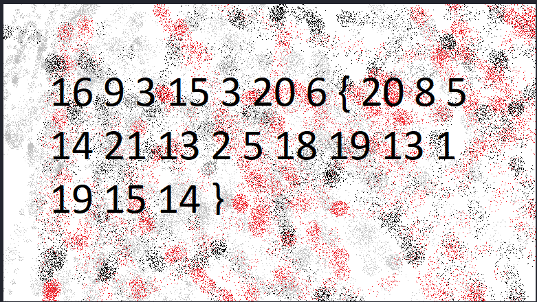

#### Descrizione
I numeri... cosa significano?
#### Analisi / Ricognizione
Viene fatta scaricare un immagine che presenta dei numeri.

  

Si nota subito il pattern di una flag.
#### Sfruttamento
Assegno ogni numero alla corrispettiva lettera dell'alfabeto e ottengo la flag.
#### Flag
picoCTF{thenumbersmason}
