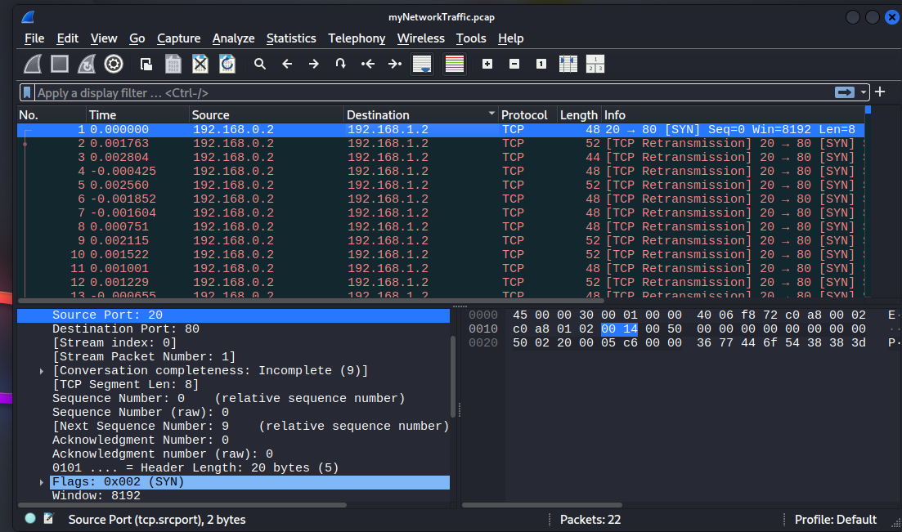
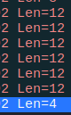

#### 🛠️Tool usati
- [Wireshark](../../../../../../tools/wireshark.md)
- [base64](../../../../../../tools/base64.md)

#### 🧩Descrizione
"Un fantasma digitale ha violato le mie difese e i miei dati sensibili sono stati rubati! 😱💻 La tua missione è scoprire come questo intruso fantasma si sia infiltrato nel mio sistema e recuperare il flag nascosto. Per risolvere questa sfida, dovrai analizzare il file PCAP fornito e individuare il metodo di attacco. L'autore dell'attacco ha abilmente nascosto le sue mosse con grande tempismo. Immergiti nel traffico di rete, applica i filtri giusti, dai prova delle tue abilità forensi e smaschera l'intruso digitale!"

#### 🔍Analisi / Ricognizione
Come prima cosa ho aperto il file PCAP fornito dalla challenge in Wireshark.

<p>  </p>

Uno degli hint suggeriva che usare il tempo come filtro avrebbe aiutato a trovare la flag finale.

#### ⚙️Sfruttamento
Così, una volta riordinati i pacchetti, ho notato che ve ne erano 7 con dimensione diversa dagli 8 byte del resto del traffico:
<p>  </p>

Guardando il contenuto di ognuno ho notato che il payload conteneva delle stringhe codificate in base64, così ho estratto ogni stringa e l'ho decodificata, ottenendo la flag:

```bash
echo "cGljb0NURg==" | base64 --decode             picoCTF
```
#### 🚩Flag
picoCTF{1t_w4snt_th4t_34sy_tbh_4r_2e1ff063}

#### 💡Lezioni apprese
Analizzare un file PCAP non significa guardare solo i payload dei singoli pacchetti, ma anche le loro caratteristiche "di superficie" (dimensione, timing, frequenza) che da sole possono rivelare anomalie rispetto al traffico normale.


