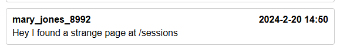
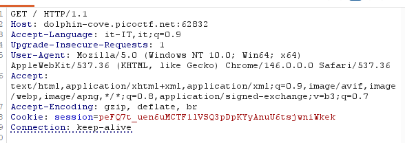

### Descrizione
Una corretta gestione del timeout di sessione è fondamentale per la sicurezza degli account utente. 
Se un utente effettua l'accesso da un computer pubblico o condiviso ma non si disconnette esplicitamente (limitandosi a chiudere la scheda del browser) e le date di scadenza della sessione non sono configurate correttamente, la sessione potrebbe rimanere attiva indefinitamente. 
Ciò consente a un malintenzionato che utilizzi successivamente lo stesso browser di accedere all'account dell'utente senza bisogno di credenziali, sfruttando il fatto che le sessioni non scadono mai e rimangono autenticate.

### Ricongizione

1. Ho aperto la pagina di login dell'applicazione.
2.  Ho usato gli strumenti sviluppatore per ispezionare la pagina
3. Mi sono registrato con un utente di prova e ho fatto il login
4. Nella homepage del sito ho visto questo commento: 
  

### Individuazione cookie di sessione
Navigando verso: http://dolphin-cove.picoctf.net:58666/sessions ho trovato l'elenco dei cookie di sessione attivi degli utenti registrati:
1) session:peFQ7t_uen6uMCTF1lVSQ3pDpKYyAnuU6tsjwniWkek, {'_permanent': True, 'key': 'admin'}

2) session:WxOFb74PDgJUhi17EYQLexUOTaQ9izQs0xhNRXStGS8, {'_permanent': True, 'key': 'try'}

### Sfruttamento con Burp Suite
- **Proxy -> Intercept**: ho attivato l'intercettazione e ho fatto passare dal proxy di Burp la richiesta GET verso la home page dell'applicazione.
- **Send to Repeater**: ho inoltrato la richiesta intercettata al modulo Repeater per poterla modificare e reinviare liberamente.
- **Sostituzione cookie**: Ho aggiunto all'header la richiesta con il cookie:
  
  
]
- **Send**: la risposta è stata 200 OK, e il body HTML della homepage caricato come utente admin contenente anche la flag

### Flag
picoCTF{s3t_s3ss10n_3xp1rat10n5_51c526ab}

### Remediation
- Impostare un'expiration ragionevole per tutti i cookie di sessione, sia lato server sia tramite l'attributo Expires/Max-Age del cookie.
- Invalidare la sessione lato server al logout, non solo lato client.
- Non esporre mai un endpoint che elenca le sessioni attive di altri utenti