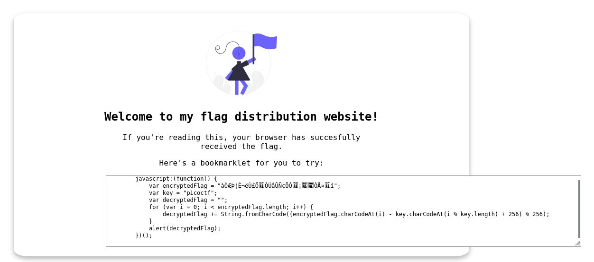

#### 🧩Descrizione

Perché cercare la bandiera quando posso fare un bookmarklet per stamparla per me?

#### 🔍Analisi / Ricognizione

La pagina web mostrava subito la funzione JS per calcolare la flag.

  

#### ⚙️Sfruttamento

Sono andato su una console JS online, ho fatto partire la funzione e ho ottenuto la flag.

#### 🚩Flag

picoCTF{p@g3_turn3r_0148cb05}

#### 💡Lezioni apprese

- Quando una pagina espone direttamente nel codice sorgente/JS la logica che genera la flag, spesso basta eseguire quella funzione (in console o con un bookmarklet) invece di reimplementarla o analizzarla a mano.
- Controllare sempre lo script lato client prima di cercare vulnerabilità più complesse: a volte la soluzione è già "scritta" nella pagina.