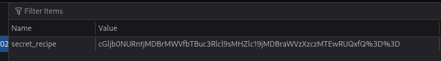

#### 🛠️Tool usati

- [[base64]]
- DevTools

#### 🧩Descrizione

Cookie Monster ha nascosto la sua ricetta di biscotti top-secret da qualche parte sul suo sito web. Come aspirante detective dei biscotti, la tua missione è scoprire questo delizioso segreto. Puoi superare in astuzia Cookie Monster e trovare la ricetta nascosta?

#### 🔍Analisi / Ricognizione

Ho inserito delle credenziali arbitrarie (casuali) nel form. La pagina web suggeriva che l'autenticazione reale non dipendesse dalle credenziali inserite, ma da qualcos'altro gestito lato client.

Ho aperto gli strumenti sviluppatori del browser → Storage → Cookie. Abbiamo individuato un cookie sospetto.
<p align="center">  </p>

#### ⚙️Sfruttamento

Il valore del cookie rispettava tutte le caratteristiche di una stringa Base64. Così ho provato la decodifica e ho ottenuto la flag:

```bash
echo cGljb0NURntjMDBrMWVfbTBuc3Rlcl9sMHZlc19jMDBraWVzXzczMTEwRUQxfQ%3D%3D | base64 -d
```

#### 🚩Flag

picoCTF{c00k1e_m0nster_l0ves_c00kies_73110ED1}

#### 💡Lezioni apprese

- Se un form di login "ignora" credenziali arbitrarie senza dare errore, l'autenticazione va probabilmente cercata lato client (cookie, localStorage, JWT) piuttosto che nel meccanismo di validazione stesso.
- I cookie vanno sempre ispezionati con DevTools prima di assumere che la logica di auth sia solo server-side: valori che sembrano stringhe casuali (padding `%3D%3D` = `==` URL-encoded) sono spesso base64.