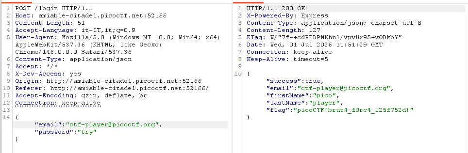

#### 🛠️Tool usati

- [`burp-suite`](https://claude.ai/tools/burp-suite.md)

#### 🧩Descrizione

Siamo nel bel mezzo di un'indagine. Si sospetta che una delle persone che stiamo indagando, nota come ctf player, stia nascondendo dati sensibili all'interno di un portale web ad accesso limitato. Abbiamo scoperto l'indirizzo email che usa per accedere: ctf-player@picoctf.org. Purtroppo, non conosciamo la password e i soliti tentativi non hanno funzionato. Ma qualcosa non quadra... è quasi come se lo sviluppatore avesse lasciato un accesso segreto. Riuscite a scoprirlo?

#### 🔍Analisi / Ricognizione

Ispezionando il sorgente HTML della pagina di login, è stato trovato un commento sospetto subito sopra il form:

```html
<!-- ABGR: Wnpx - grzcbenel olcnff: hfr urnqre "K-Qri-Npprff: lrf" -->
```

Il testo era cifrato con il Cifrario di Cesare, k=13 (ROT13). Decifrato risulta:

```
NOTE JACK - TEMPORARY BYPASS: USE HEADER "X-DEV-ACCESS: YES"
```

Uno sviluppatore (Jack) aveva lasciato un backdoor temporaneo non rimosso prima del deploy in produzione.

#### ⚙️Sfruttamento

- Intercettata una richiesta POST verso `/login` con Burp Suite.
- Aggiunto l'header custom: `X-Dev-Access: yes`.
- Inserita nel Body l'email suggerita dalla descrizione della macchina.
- Ottengo la risposta con la flag:
<p align="center">  </p>

#### 🚩Flag

picoCTF{brut4_f0rc4_125f752d}

#### 💡Lezioni apprese

- I commenti HTML lasciati nel sorgente in produzione sono un punto di ricognizione fondamentale: spesso contengono note di debug o backdoor dimenticate.
- ROT13/Cesare è una codifica debolissima (solo 25 chiavi possibili, o riconoscibile a colpo d'occhio per il pattern) usata a volte per "offuscare" superficialmente testo sensibile: va sempre provata su stringhe sospette.
- Header custom di bypass (`X-Dev-Access`, `X-Debug`, ecc.) lasciati per comodità in fase di sviluppo sono una backdoor reale se non rimossi prima del deploy: vanno sempre testati quando se ne trova traccia nel codice o nei commenti.