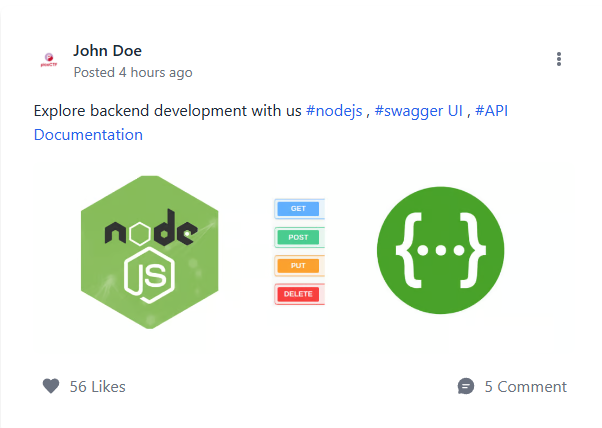
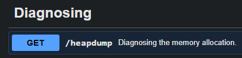

#### Descrizione
Benvenuti alla sfida! In questa sfida, esplorerete un'applicazione web e troverete un endpoint che espone un file contenente una flag nascosta. L'applicazione è un semplice sito web di blog dove potete leggere articoli su vari argomenti, incluso un articolo sulla documentazione delle API. Il vostro obiettivo è esplorare l'applicazione e trovare l'endpoint che genera file contenenti la memoria del server, dove è nascosta una flag segreta.

#### Ricognizione
Il sito web esponeva la documentazione API (Swagger) pubblicamente
<p align="center">  </p>

Sfogliando le operazioni disponibili, ho trovato un endpoint **GET /heapdump**, che non richiedeva autenticazione o parametri.

<p align="center">  </p>
#### Identificazione del path corretto
Usando la funzione "Try it out" di Swagger UI è stato possibile ottenere il comando curl esatto generato dai tool con il path corretto:

```bash
curl -X GET "http://verbal-sleep.picoctf.net:54122/heapdump" \
  -H "accept: */*" \
  -o heapdump.heapsnapshot
```

l'estensione .heapsnapshot indicava un'applicazione Node.js/V8.

#### Estrazione della flag
Dato che le stringhe allocate in memoria (variabili, valori) sono presenti come testo semplice all'interno della struttura JSON, è stato sufficientemente usare un grep mirato:

```bash
grep -o "picoCTF{[^}]*}" heapdump.heapsnapshot
```

#### Flag
picoCTF{Pat!3nt_15_Th3_K3y_59106086}

---
#### Root cause

Endpoint di diagnostica/debug (`/heapdump`) esposto pubblicamente senza:
- autenticazione/autorizzazione
- restrizione per IP o rete interna
- disabilitazione in ambiente non-development

#### Remediation

- Disabilitare o rimuovere gli endpoint diagnostici in ambienti di produzione
- Se necessari (es. per debugging in staging), proteggerli con autenticazione forte e restringerli a rete interna/VPN
- Applicare il principio del _least exposure_: la documentazione API stessa (Swagger UI) non dovrebbe essere pubblicamente accessibile se rivela endpoint sensibili