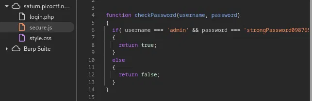

#### Descrizione
Pagina web con una form di login

#### Ricognizione
La pagina di login (`login.php`) ha all'interno del codice sorgente uno script per controllare username e password. 
 
```bash

      function filter(string) {
        filterPassed = true;
        for (let i =0; i < string.length; i++){
          cc = string.charCodeAt(i);
          
          if ( (cc >= 48 && cc <= 57) ||
               (cc >= 65 && cc <= 90) ||
               (cc >= 97 && cc <= 122) )
          {
            filterPassed = true;     
          }
          else
          {
            return false;
          }
        }
        
        return true;
      }
    
      window.username = "!";
      window.password = "!";
      
      usernameFilterPassed = filter(window.username);
      passwordFilterPassed = filter(window.password);
      
      if ( usernameFilterPassed && passwordFilterPassed ) {
      
        loggedIn = checkPassword(window.username, window.password);
        
        if(loggedIn)
        {
          document.getElementById('msg').innerHTML = "Log In Successful";
          document.getElementById('adminFormHash').value = "2196812e91c29df34f5e217cfd639881";
          document.getElementById('hiddenAdminForm').submit();
        }
        else
        {
          document.getElementById('msg').innerHTML = "Log In Failed";
        }
      }
      else {
        document.getElementById('msg').innerHTML = "Illegal character in username or password."
      }
```    

Ispezionando questo codice ho notato che la funzione `checkPassword` era solo invocata ma non dichiarata in questo script.
Sono andato allora sul tab **Sources** per vedere tutti i file effettivamente caricati dal browser durante il rendering della pagina.

Ho trovato nel file `secure.js` la logica dietro alla funzione `checkPassword`:
<p align="center">  </p>
Ho inserito nei campi form le credenziali richieste e ho ottenuto la flag.

#### Flag
picoCTF{j5_15_7r4n5p4r3n7_b0c2c9cb} 