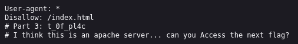
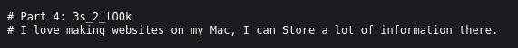
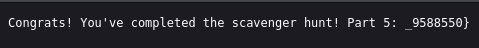

#### 🧩Descrizione

Ci sono alcune informazioni interessanti nascoste nel sito, riesci a trovarle?

#### 🔍Analisi / Ricognizione

1° parte della flag: nel codice sorgente della pagina HTML (View Source) era presente un commento con la prima parte della flag.

2° parte della flag: anche il file CSS conteneva un commento con la seconda parte della flag.

3° parte della flag: nel file JS c'era un commento con una domanda: "How can I keep Google from indexing my website?". Questo è un hint verso `robots.txt`, un file standard che i siti usano per dire ai motori di ricerca quali percorsi possono/non possono essere indicizzati. Navigando su `/robots.txt` ho trovato la terza parte della flag, con un hint verso la parte successiva.

  

4° parte della flag: il sito comunicava che gira su server Apache, che spesso espone (per errore di configurazione) file "nascosti" come `.htaccess` o `.htpasswd` se non sono protetti correttamente. Provando `/.htaccess` ho trovato la flag finale di questa fase.

  

Ultima flag: il sito accennava al fatto che il creatore sviluppa su Mac, dove viene salvato molto spesso il file `.DS_Store`, un file proprietario di macOS che contiene metadati/attributi sulla cartella in cui si trova (viene creato automaticamente da Finder in ogni cartella). Se il sito viene deployato senza escluderlo, resta accessibile pubblicamente e spesso rivela la struttura di file/cartelle del progetto. Navigando su `/.DS_Store` ho ottenuto l'ultima flag.

  

#### ⚙️Sfruttamento

Unendo tutte le parti trovate in HTML, CSS, `robots.txt`, `.htaccess` e `.DS_Store` ho ricostruito la flag completa.

#### 🚩Flag

picoCTF{th4ts_4_l0t_0f_pl4c3s_2_lO0k_9588550}

#### 💡Lezioni apprese

- [[robots.txt]] è un file che si trova nella root di (quasi) ogni sito (`/robots.txt`) e dice ai crawler (Google, Bing, ecc.) quali percorsi non indicizzare. È pensato per i motori di ricerca, non per la sicurezza — ma spesso finisce per elencare proprio i path "sensibili" che lo sviluppatore vuole nascondere dai risultati di ricerca, il che paradossalmente li rivela a chi lo controlla manualmente.
- File nascosti esposti su server Apache: file come `.htaccess` (regole di configurazione Apache, spesso usato anche per proteggere/reindirizzare risorse) e `.htpasswd` (credenziali per autenticazione HTTP Basic) dovrebbero essere bloccati dal server stesso, ma se la configurazione è errata restano accessibili via browser. Vale la pena provarli sempre in fase di recon, insieme ad altri path comuni (`/.git/`, `/.env`, `/backup`, ecc.).
- `.DS_Store`: file generato automaticamente da macOS Finder in ogni cartella, contiene metadati sulla cartella stessa (es. nomi di file al suo interno, anche se non più presenti). Se uno sviluppatore fa il deploy di un sito da Mac senza escludere questo file (es. tramite `.gitignore` o configurazione del server), chiunque può scaricarlo e ottenere una mappa della struttura interna del progetto.